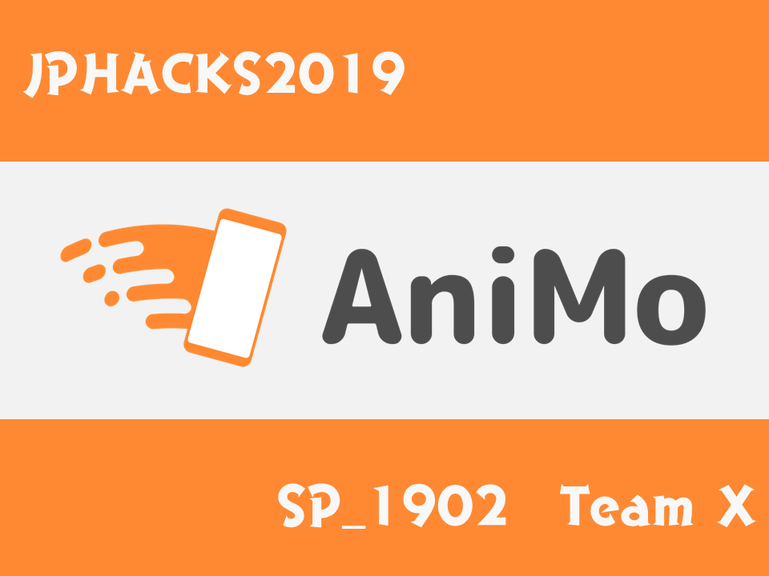
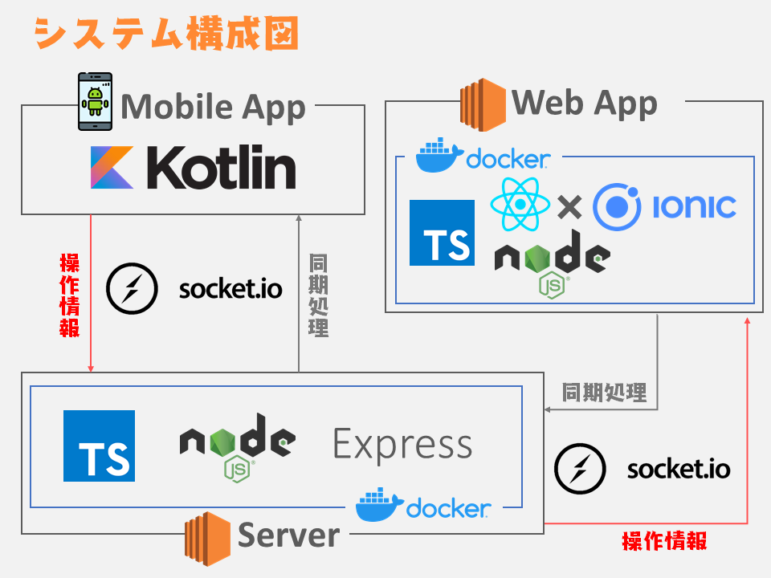
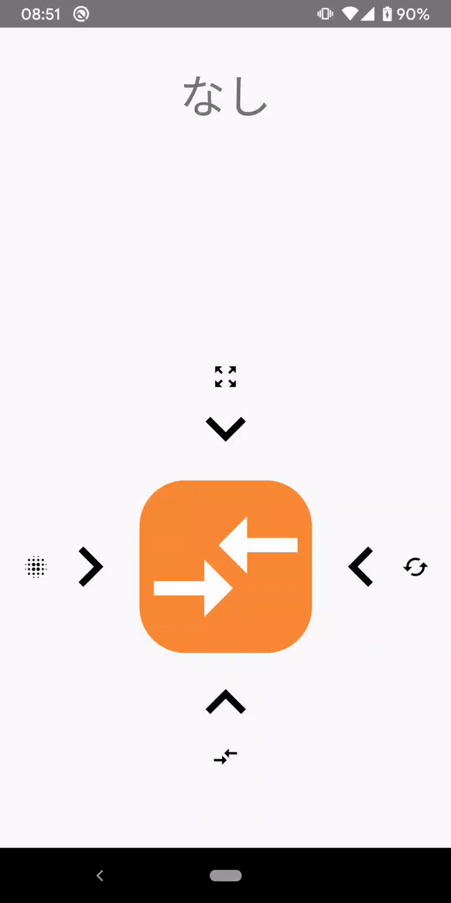

# AniMo

## 製品概要
### Presentation x Tech

### 背景（製品開発のきっかけ，課題等）
私達はプレゼンテーションが苦手です．
Lightning-Talk等のプレゼンテーション（以下プレゼン）でプレゼンターは魅力的な発表をしていますが，プレゼン形式は皆一様で形骸化しています．プレゼンはプレゼンターの能力によって魅力度が大きく左右されてしまいます．
私達はプレゼン時の画面遷移のときに発生する「アニメーション」とプレゼンターの「モーション」に着目して課題を抽出しました．現状のプレゼンは予め設定したアニメーションを元にプレゼンターが淡々とプレゼンをしています．プレゼンターが強調したい箇所や緩急をつけたい場所で自分の思い通りに再現することは困難です．そこで私達は「プレゼンターが振る舞うモーション」と「画面遷移時に発生するアニメーション」の関係性に課題解決を目指してアプリケーションを開発しました．

### 製品説明（具体的な製品の説明）
「AniMo」はプレゼンターの「モーション(Motion)」に合わせて投影資料の「アニメーション(Animation)」を変化させることによってこの課題を解決します．スマートフォンの加速度センサからプレゼンターのモーションを検知することで，プレゼンターの振る舞いに同期したスライドアニメーションを実現します．
AniMoのアピールポイントは『プレゼンター同期型のプレゼン』です．プレゼンターがプレゼン中に振る舞うモーションに合わせてスライドが遷移する事によって，聴衆者をより惹きつけられる魅力的なプレゼンを実現します．
上記の機能を実現するために，私達は《プレゼンターがリモコンとして使用するモバイルアプリ》と《プレゼン資料を投影するWebアプリ》の２つプロダクトを開発しました．
プロダクトの開発では，グループメンバーが得意としているモダンな言語やライブラリー，フレームワークを活用することで，ハッカソンという限られた時間でも洗礼されたデザインや機能を実装したプロダクトを実現しました．
### 特長

#### プレゼンター同期型のプレゼン

このプロダクトの最大の特徴は「プレゼンター同期型のプレゼン」です．プレゼンターがプレゼン中に振る舞うモーションに合わせてスライドが遷移する事によって，聴衆者をより惹きつけられる魅力的なプレゼンを実現します．
上記の機能を実現するために，私達は《プレゼンターがリモコンとして使用するモバイルアプリ》と《プレゼン資料を投影するWebアプリ》の２つのプロダクトを開発しました．
プレゼンター同期型のプレゼンとして以下の2つが大きな特徴になっています．

##### 1. 同じスライドに対して様々な画面遷移が選択可能

プレゼンターがモバイルアプリでスライドに適用するアニメーションを選択できるため，同じ一つのスライドでも全く異なるアニメーションで画面遷移をすることができます．この機能によってより会場の雰囲気やその場のアドリブに対応したアニメーションで画面が遷移するため，魅力的なプレゼンが実現できます．

##### 2. プレゼンターの「モーション(<u>Mo</u>tion)」に合わせた「アニメーション(<u>Ani</u>mation)」

同じ一つのスライド，アニメーションでも，プレゼンターが動いたモーションの方向を元にアニメーションが変化します．ユーザーが右に腕を振ればスライドも右側に移動し，腕を左に振ればスライドは左側に移動します．よりプレゼンターの振る舞いに合わせたスライド遷移を実現することによって聴衆者の印象に残るプレゼンを実現します．

### 解決出来ること
1. プレゼンターとプレゼン資料の同期によるプレゼンの抑揚と緩急の実現
2. 会場の雰囲気・状況に合わせたプレゼンの実現

プレゼンター同期型プレゼンで，よりプレゼンのその場の雰囲気に合わせたプレゼンが実現できます．
また，魅力的なプレゼンの一つに「プレゼンターの振る舞い」があります．このプロダクトを活用することでプレゼンターは自然にモーションを意識してプレゼンをします．その結果，プレゼンターは自然に抑揚・緩急のある魅力的なプレゼンを実現できます．

### 今後の展望
1. Mobile AppとWeb Appの1対1連携
    - 今回のプロトタイプでは，通信のセッションまで実装できなかったため，同時に一つのスライドしか操作できません．ウェブソケット通信にセッションを付与することで複数ユーザが利用可能になります．
2. スライドの読み込み（Web App)
    - 今回のプロトタイプでは， 固定のスライドのインポートしかできませんでした．ユーザのスライドを読み込みできることで，さらに利便性が向上します．
5. アニメーション作成機能と開発者専用アプリの開発
    - LINEスタンプのように《アニメーションをオリジナルで作成するプラットフォーム》と《作成したアニメーションを公開できるストア》を開発することで，より魅力的なプレゼンを実現できます．また，ビジネスモデルの観点で考えると，収益の見込みとより多くのユーザがAniMoに触れる機会が生まれると考えられます．
6. ユーザによるアニメーションのカスタマイズ
    - 開発者ストアで購入したアニメーションをMobile Appで選んで自分がプレゼンで利用したいアニメーションを適宜カスタマイズすることが出来るようになると考えます．
7. モーションの拡張
    - 限定的だったモーション検知の精度を上げることで，斜め方向などより柔軟な操作を可能にします．更に，加速度に合わせてアニメーションの遷移動作を変更できるようにします．それにより，よりダイナミックなアニメーションをスムーズに行うことができるようになります．

## 開発内容・開発技術

## デモ

### Web スライドビュワー

- [こちら](http://ec2-54-199-159-79.ap-northeast-1.compute.amazonaws.com) から実際の動作を確認できます。

### モバイル コントローラー（Android）

### 活用した技術

#### フレームワーク・ライブラリ・モジュール
* Kotlin
* Android
* TypeScript
* node.js
* React
* Ionic
* Docker
* express
* socket.io
* AWS

#### デバイス
* Android端末
    * 加速度センサー
* PC （Web）

### 研究内容・事前開発
* 今回はAndroid端末で《姿勢の検知》と《端末を振った方向を加速度センサで検知》をしました．重力加速度を用いて姿勢を検知することで，姿勢に合わせて端末を振った方向を検出しました．加速度センサについて担当したメンバーは大学で，センサを用いて実世界に役立つシステムを考える研究室に所属しており，研究室のゼミで得られた知見をもとに事前に既存研究を調査してセンサ検出プログラムを開発しました．
* socket.ioを用いたAndroidアプリケーションとWebアプリケーションとの双方向通信を実現しました．スマートフォンから取得した動作とアニメーションの情報をスライドショーを表示しているWebアプリケーションにAWSを介して通知してスライドを遷移させています．HackDay前日にWebアプリのみでsocket.ioの動作を調査して，実現できることを確認しました．

### 独自開発技術（Hack Dayで開発したもの）
#### 2日間に開発した独自の機能・技術
* Androidの加速度センサによる端末の姿勢と端末の振った方向を検出
* socket.ioでの双方向通信
* Webフロントで複数のアニメーションを用いたスライドの遷移

